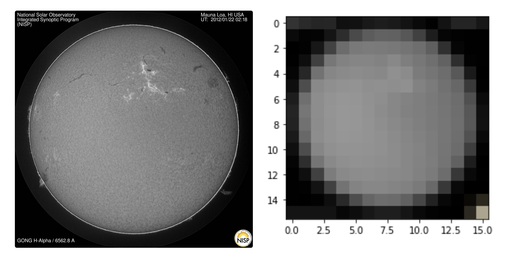
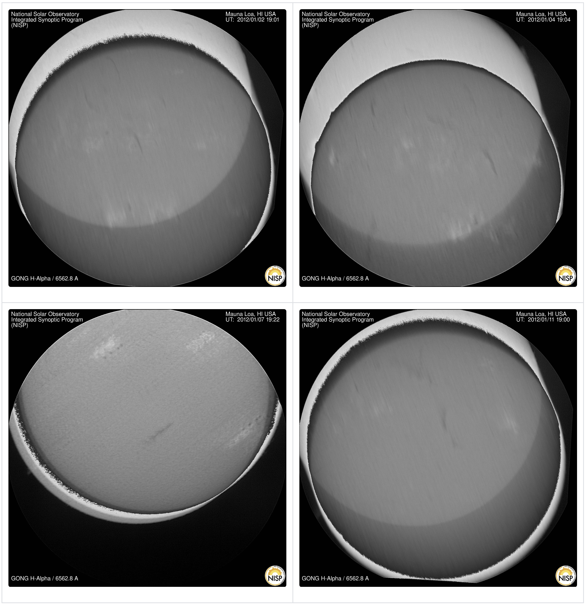
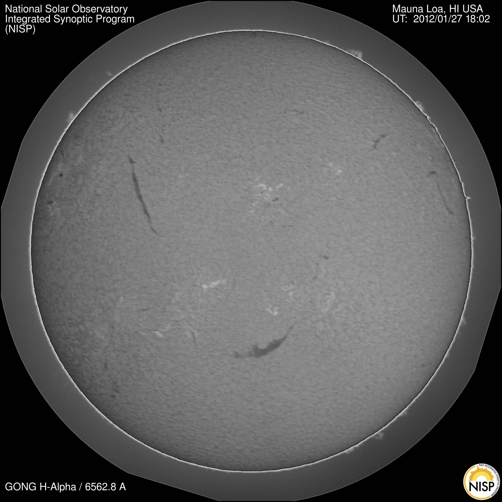
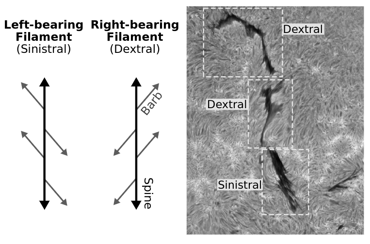
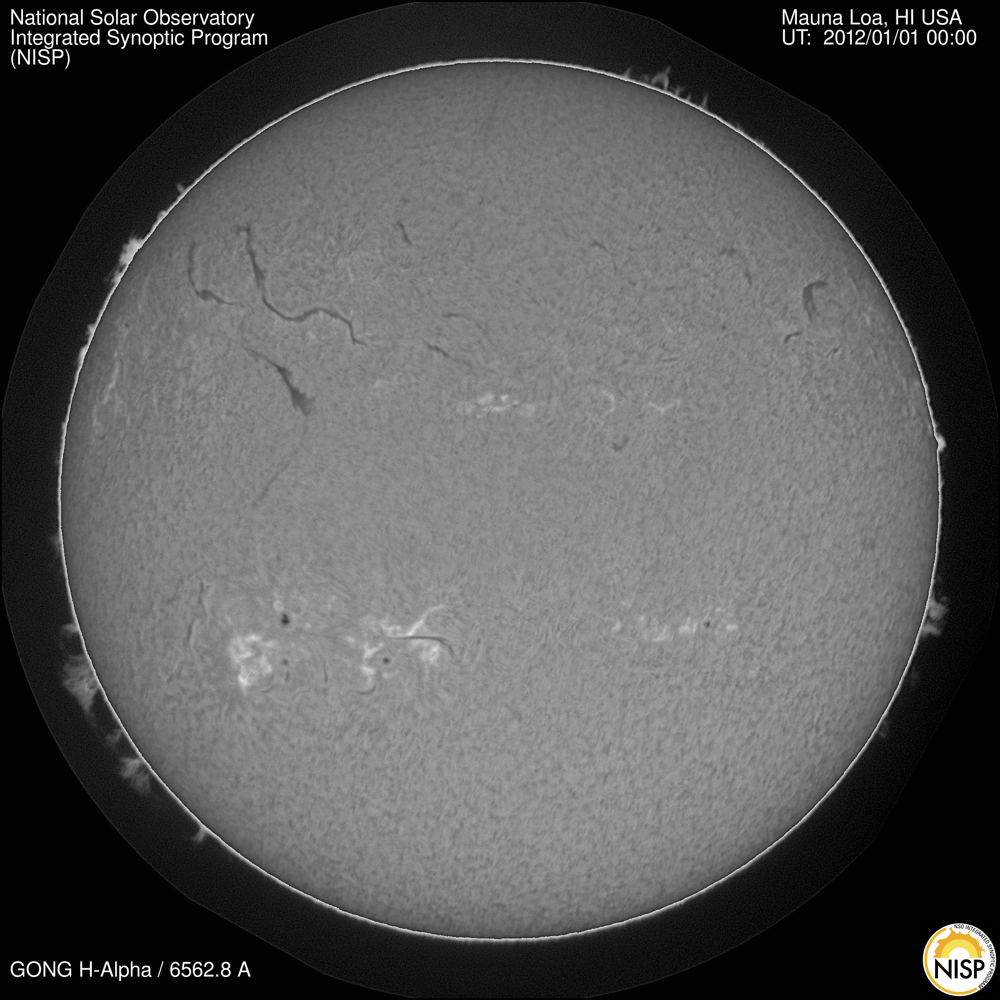

# MLEco
## Anomaly Detection on Solar Images by Statistical Analysis

### Overview
This project was undertaken as part of my Capstone course during the final year of my undergraduate degree. The project was part of a larger research project aimed at developing deep neural networks for identifying solar filaments. As part of that project, it was necessary to determine a method for accurately identifying corrupt and unusable images in order to exclude them from analysis, thereby saving time and resources. 

### Goal
The purpose of anomaly detection for our use is to identify “corrupted” (unsuitable) images in order to exclude them from human processing. Because the scale of our data is so large, and because we must pay to have each image processed by hand, it is vital to the longevity of our research that only those images containing useable data are selected for processing. 

### Corrupted Images
Here are a few examples of corrupted images:  
https://gong2.nso.edu/HA/hag/201201/20120101/20120101185314Mh.jpg  
https://gong2.nso.edu/HA/hag/201201/20120126/20120126175014Mh.jpg  
https://gong2.nso.edu/HA/hag/201201/20120131/20120131215214Mh.jpg  
https://gong2.nso.edu/HA/hag/201201/20120117/20120117180714Mh.jpg  
https://gong2.nso.edu/HA/hag/201201/20120117/20120117175914Mh.jpg

An image with a shadow of an airplane on it:  
https://gong2.nso.edu/HA/hag/202207/20220713/20220713164632Bh.jpg

An image indicating that the instrument is under maintenance:  
https://gong2.nso.edu/HA/hag/201506/20150616/20150616000114Sh.jpg

20220713164632

### The Process
Our approach to anomaly detection is straightforward.

1.	Collect image data as unique URLs. 
2.	Download and process each image in turn by:
    1.	Extracting the image
    2.	Resizing the image
    3.	Calculating pixel brightness of the new image and
    4.	Determining through comparison which images are unusable
3.	Returning a dataset of unusable images.

### Downsampling
In order to achieve this goal, we ran multiple evaluations, beginning with visually confirming that the resized images matched the original image without transformation. Here you can see the main image has been reduced to a 16x16 image without any additional transformations:



  
### Brightness Data
Our next step involved feeding an array of image URLs into a function designed to downsample them and return a data frame where each row represents an image, and each column represents the brightness of a pixel. 

Next, we calculated an acceptable range for each set of corresponding pixels, each column, by defining a customized quartile range. 

```Python
for col in df:
    pl = np.percentile(df[col], lower_range)
    ph = np.percentile(df[col], upper_range)
    iqr = ph - pl
    lower = pl - iqr * 1.5
    upper = ph + iqr * 1.5
    df[col] = df[col].between(lower, upper)
```

After some trial and error, we landed on an upper range of the 96th percentile and a lower range of the 4th percentile. In the code above, you can see that we used a basic outlier calculation to determine the acceptable values for each image section. This approach allowed us to set the range for every column value individually.

### Using the Model
The code snippet below shows a basic execution of the model where the “begin” and “end” represent the window of time from which the samples are being collected.

```Python
begin = "2012-01-01 00:00:01"
end = "2012-02-01 23:59:59"

image_data: VSOSearchResult = sample_by_size(begin, end, 100, "maunaloa")
image_data.generate_url_metadata(fits_urls=True, header_urls=True, jpg_urls=True)
image_urls = image_data.jpg_urls

pixel_data = get_pixel_data(image_urls, 16)
corrupt_images = find_corrupt_images(pixel_data)
```

The `get_pixel_data` function takes a list of image URLs and an integer that determines the number of cells per side for converting the existing image into the downsampled image. In the code above, 100 image URLs were passed into the get_pixel_data function and the side length was set to 16 cells.

The `find_corrupt_images` function takes a dataframe of image brightness values by cell.

The output of this code is a list of URLs corresponding to images that the model has identified as corrupted…

```Python
https://gong2.nso.edu/HA/hag/201201/20120102/20120102190114Mh.jpg
https://gong2.nso.edu/HA/hag/201201/20120104/20120104190414Mh.jpg
https://gong2.nso.edu/HA/hag/201201/20120107/20120107192214Mh.jpg
https://gong2.nso.edu/HA/hag/201201/20120111/20120111190014Mh.jpg
```

As you can see from the links above, each URL leads to a corrupted image, and a manual examination of all 100 sampled images showed that these 4 images were indeed the only corrupted images in the set.

### Validation with Isolation Forest
We validated our model by applying Isolation Forest to the dataset to see how our flagged images compared to those images flagged by Isolation Forest. Because our interactions with data have led us to estimate the rate of corruption is somewhere between 4 and 5 percent, we set the contamination parameter for Isolation Forrest at 0.05 to avoid missing and potentially flagged images.

The model returned these four corrupted images below:




Isolation Forrest returned these four images, as well as the image below:


 
This is an example where the relative brightness of an image differs from those around it in the sample which is why it was selected by Isolation Forest, but the continuity between the two models serves as a good validation that our approach is effective.

### Notes for Using the Model
Even though our approach worked very well, there are some details that should be considered when using the model at scale.

Our approach was extremely effective at identifying structural anomalies in the sampled images, primarily lens shift, and lens obstructions. 

On the other hand, our model was not designed to detect more subjective types of distortions, such as blurred images, or images with markedly different levels of brightness than the standard sampled images. 

As a result, this model has effectively no ability to distinguish between a blurred image and a clear one, regardless of how clear or blurred the image is. It also tends to flag those images with the highest variance in brightness compared to other images as corrupt, even when they might be usable.

## The Bigger Picture

### What Are Filaments?
Filaments are dense “clouds” of solar material suspended by magnetic field lines above photospheric neutral lines. They are formed above magnetic Polarity Inversion Lines (PILs), and thus serve as a visual trace for polar field reversal---one of the key aspects of solar magnetic cycle.
What Is Their Importance?

The significance of filaments for space weather lies in that filaments are at the core of solar eruptions (Coronal Mass Ejections, CMEs), solar flares, and Solar Energetic Particle (SEP) storms. An Earth-directed CME can cause enormous damage to our electric power supply grid, offset the GPS system, create radiation hazards for passengers and crew on polar flights, and can be lethal for astronauts as they travel outside the protective bubble provided by the Earth's magnetosphere. A 2008 report by the Space Studies Board of the National Research Council concludes that a solar superstorm, similar to the once-in-a-century [1859 Carrington event](https://en.wikipedia.org/wiki/Carrington_Event), could cripple the entire US power grid for months and lead to economic damage of $1-2 trillion. Large CMEs and high-intensity solar flares are almost always initiated and driven by the eruption of a solar filament.

### What is Chirality?
The direction of the axial field of filaments on the Sun---that we wish to know---can be determined from full-disk H-alpha observations and magnetograms, both of which are acquired 24/7 through GONG. The direction of filaments determines the direction of their axial field except for its sign (the magnetic field vector can point in two directions along the axis). Martin, in a series of groundbreaking papers in the 90s, introduced a method to determine the sign of the axial magnetic field in filaments from H-alpha observations. She showed that chirality can be determined from H-alpha images alone through morphological image analysis of the filaments.



### What is GONG Network?
A global network (GONG) exists that monitors the solar disk for filaments 24/7 to catch eruptions as they happen. From there it takes a CME several days to reach the Earth and have its full impact. The system we propose will derive the metadata therefrom in an automated fashion to simplify monitoring and help predict such eruptions and their effectiveness. 
 
### What is an H-alpha image?
Filaments appear in the solar corona that are visible in absorption of the H-alpha line on the disk and in emission off the solar limb. We refer to such observations with H-alpha filters as H-alpha images.



### What is a FITS format? How to Open It?
[FITS](https://fits.gsfc.nasa.gov/) is short for 'Flexible Image Transport System', and is the standard data format used in astronomy. All observations of the GONG network are stored as FITS files.

There are 2 key points about FITS files that you should know:
- Unlike popular image formats such as JPG, PNG, GIF, etc. whose pixel intensity values are limited to 256 different values, each pixel corresponds to a value in the range (0, 16383).
- There is an embedded header in each FITS file that has a lot of information about the observation (such as the observation time, exposure time, instrument name, location of the Sun’s center in the image, etc). To see an example of a header file, click [here](https://gong2.nso.edu/HA/hah/201201/20120101/20120101000014Mh.hdr).

### How to Open an H-alpha Image?
For interactive purposes, we use DS9, which is a light software for opening FITS files, as well as their headers. Download it from [here](https://sites.google.com/cfa.harvard.edu/saoimageds9/download).

For processing of FITS images, we should use the [Astropy](https://www.astropy.org/) package to properly load FITS files, as well as their header data. There are plenty of examples in this [link](https://docs.astropy.org/en/stable/io/fits/index.html).


## Using/Testing the Algorithm

* Updating - check back soon


